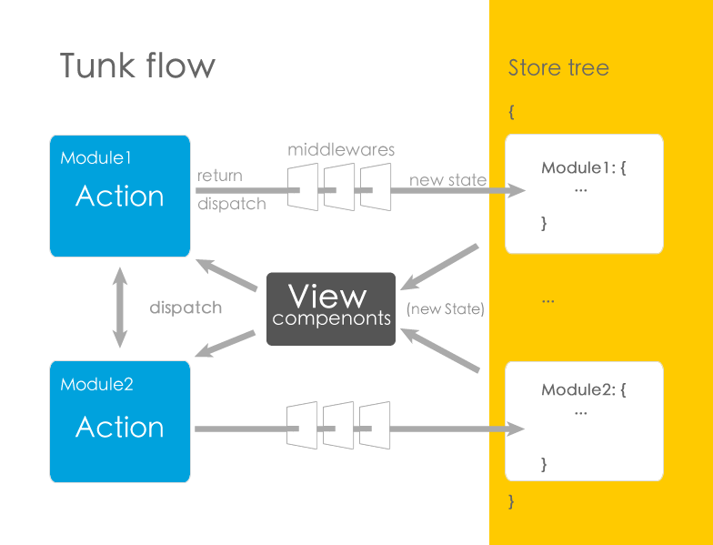

1. 视图层触发交互事件
1. 交互事件回调发起Action执行
1. 执行Action
1. Action返回的结果或dispatch的数据，进入中间件处理流程
1. 满足一定条件进入到内置store中间件后，调起setStore钩子
1. setStore钩子执行Store对象提供的方法 store.setState 将定义为状态的字段数据存储到store，并返回action执行返回的所有数据
1. 让视图框架跟tunk一起工作的组件（如tunk-vue）切入setStore钩子获得状态更新的通知
1. 在切入setStore钩子的回调，获取到新状态并找到绑定了新状态相关字段的视图组件，将新状态数据逐一注入其中

